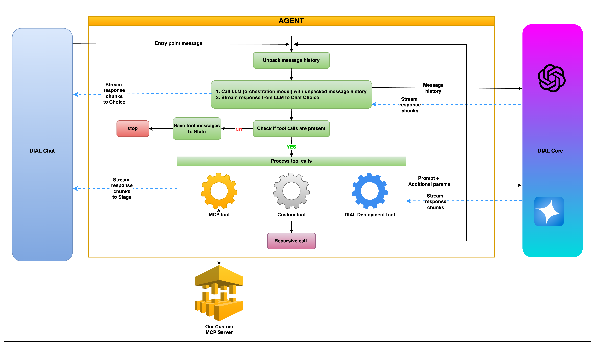

# DIAL Agent Implementation

## 🎯 Task Overview

With this task you will create AI agent with custom tool, MCP tools and DIAL deployment tools, practice with streaming in Choice and Stage in DIAL Chat. 

## 🎓 Learning Goals

By completing this project, you will learn:

- **AI Agent Architecture**: Building intelligent agents that can orchestrate multiple tools
- **Tool Orchestration**: Combining MCP tools, custom tools and deployment-based tools (web search, image generation)
- **Streaming & Real-time Processing**: Handling streaming responses and real-time tool execution
- **DIAL Integration**: Working with DIAL API for AI model interactions

## 🏗️ Architecture

```
project/
├── core/
│   └── config.json                  🚧 DIAL Core config
├── mcp_server/
│   ├── server.py                    ✅ MCP server with tools (complete)
│   ├── Dockerfile                   ✅ Container configuration
│   └── docker-compose.yml           ✅ Service orchestration
├── task/
│   ├── app.py                       🚧 Main application entry point
│   ├── llm_agent.py                 🚧 Core agent logic with tool orchestration
│   ├── tools/
│   │   ├── base.py                  ✅ Abstract tool interface
│   │   ├── calculator.py            🚧 Basic calculator tool
│   │   ├── deployment/
│   │   │   ├── base.py              ✅ Deployment tool base class
│   │   │   ├── web_search.py        ✅ Web search tool
│   │   │   └── image_generation.py  ✅ Image generation tool
│   │   └── mcp/
│   │       ├── mcp_client.py        ✅ MCP client implementation
│   │       ├── mcp_tool.py          ✅ MCP tool wrapper
│   │       └── mcp_tool_model.py    ✅ MCP tool data model
│   └── utils/
│       ├── history.py               ✅ Message history management
│       ├── stage.py                 ✅ Stage processing utilities
│       └── constants.py             ✅ Application constants
├── core/
│   └── config.json                  ✅ DIAL configuration
├── docker-compose.yml               ✅ Compose with all required apps
└── requirements.txt                 ✅ Dependencies
```

# 

---

## 📋 Requirements

- **Python**: 3.11 or higher
- **Docker & Docker Compose**: For containerized deployment
- **API Access**:
    - DIAL API key with appropriate permissions
    - EPAM VPN connection for internal API access
- **Optional**: Postman for API testing

## 🚀 Getting Started

### 1. Environment Setup

```bash
pip install -r requirements.txt
```

### 2. API Configuration

1. **Connect to EPAM VPN** (required for internal API access)
2. **Obtain DIAL API Key** from EPAM support and set it as env `DIAL_API_KEY` variable
3. **Set environment variables**:

## ✍️ Implementation Tasks

### Task 1: Complete MCP Server Setup

The MCP server is already implemented with three tools:
- `reverse_string`: Reverses text input
- `random_num`: Generates random numbers
- `is_palindrome`: Checks if text is a palindrome

**Steps:**
1. Review the server implementation in [mcp_server/server.py](mcp_server/server.py)
2. Start the MCP server:
   ```bash
   cd ./mcp_server/
   ```
   ```bash
   docker compose up -d
   ```
3. Verify server is running:
   ```bash
   docker compose ps -a
   ```

### Task 2: Implement Calculator Tool

Implement all `TODO` in [task/tools/calculator.py](task/tools/calculator.py):


### Task 3: Implement LLM Agent

Implement all `TODO` in [task/llm_agent.py](task/llm_agent.py):


### Task 4: Complete Application Setup

Implement all `TODO` in [task/app.py](task/app.py):


### Task 5: Configure DIAL Core

Add in the [core/config.json](core/config.json) such configurations:

- In the `applications` block:
    ```
    "super-agent": {
          "displayName": "Super Agent",
          "description": "Super Agent. Works with different DIAL Deployments, works with MCP tools, and performs simple calculations.",
          "endpoint": "http://host.docker.internal:5030/openai/deployments/super-agent/chat/completions",
          "inputAttachmentTypes": [
            "image/png",
            "image/jpeg"
          ]
        }
    ```
- In the `models` block:
    ```
     "gpt-4o": {
          "displayName": "GPT 4o",
          "endpoint": "http://adapter-dial:5000/openai/deployments/gpt-4o/chat/completions",
          "iconUrl": "http://localhost:3001/gpt4.svg",
          "type": "chat",
          "upstreams": [
            {
              "endpoint": "https://ai-proxy.lab.epam.com/openai/deployments/gpt-4o/chat/completions",
              "key": "YOUR_API_KEY"
            }
          ]
        },
        "gemini-2.0-flash-exp-google-search": {
          "displayName": "Gemini 2.0 Web Search",
          "endpoint": "http://adapter-dial:5000/openai/deployments/gemini-2.0-flash-exp-google-search/chat/completions",
          "iconUrl": "http://localhost:3001/Gemini-Pro-Vision.svg",
          "type": "chat",
          "upstreams": [
            {
              "endpoint": "https://ai-proxy.lab.epam.com/openai/deployments/gemini-2.0-flash-exp-google-search/chat/completions",
              "key": "YOUR_API_KEY"
            }
          ]
        },
        "dall-e-3": {
          "displayName": "DALL-E",
          "endpoint": "http://adapter-dial:5000/openai/deployments/dall-e-3/chat/completions",
          "iconUrl": "http://localhost:3001/gpt3.svg",
          "type": "chat",
          "upstreams": [
            {
              "endpoint": "https://ai-proxy.lab.epam.com/openai/deployments/dall-e-3/chat/completions",
              "key": "YOUR_API_KEY"
            }
          ]
        }
    ```
- Don't forget to replace `YOUR_API_KEY` with your DIAL API Key


## 🧪 Testing Scenarios

### Basic Calculator Operations
```
Calculate 495903.928834 * 39483.1038472
```

### Web Search Integration
```
What is the weather in Kyiv now?
```

### MCP Tool Testing
```
Generate a random number between 1 and 100, then check if "racecar" is a palindrome
```

### Complex Multi-Tool Requests
```
Generate a random number, then by this number search 'Magic of the {number}' and then based on the description generate an image
```

### Add in Chat some picture (png or jpeg) 
```
What do you see here?
```

---

# 